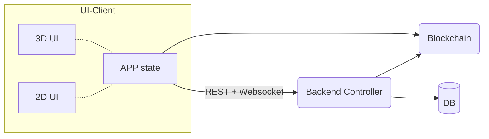
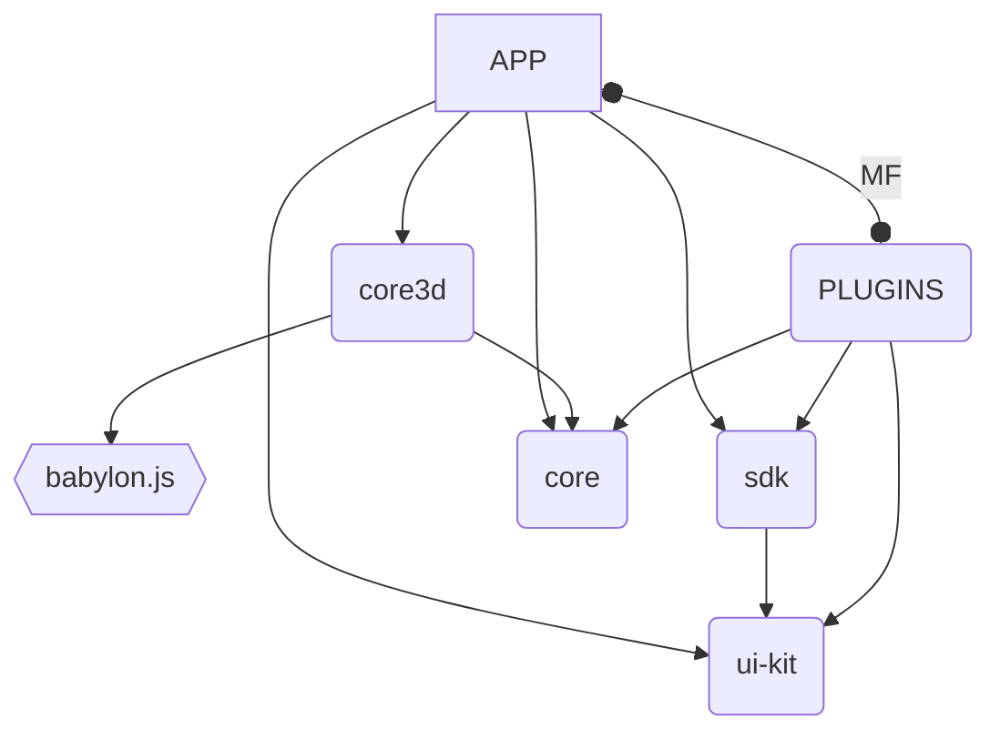

[](https://github.com/momentum-xyz/ui-client/actions/workflows/build-deploy.yml?query=branch%3Adevelop)

# Odyssey UI-Client

The UI-Client is currently a web application allowing to explore Odyssey 3D Worlds with 3D and 2D user interfaces.

It is built with React and Typescript, using Web3 style sign-in, [Mobx State Tree](https://mobx-state-tree.js.org/) for the app state management and flow and websocket-based communication layer called [posbus-client](https://github.com/momentum-xyz/posbus-client). The App and the plugins are using [Module Federation](https://webpack.js.org/concepts/module-federation/) (MF) in order to create more optimised builds and on-demand plugging in runtime



## Project packages

It is a monorepo that contains the main application and several common libraries, the plugin SDK and several the plugins that we maintain. In future the plugins may be moved to their own repositories.

    .
    ├── packages
    │   ├── app                     # Main application
    │   ├── core                    # Common reusable logic
    │   ├── core3d                  # 3D World Interface based on babylon.js
    │   ├── sdk                     # Plugins SDK
    │   ├── ui-kit                  # ui-kit with Storybook
    │   │
    │   ├── plugin_google_drive     # Google Drive plugin
    │   ├── plugin_miro             # Miro plugin
    │   └── plugin_video            # Video plugin
    └── ...

### Packages connection schema



## How to run locally

#### Installation:

We use [Github Packages](https://docs.github.com/en/packages/learn-github-packages/introduction-to-github-packages) for storing some of the dependencies requiring Github Personal Access Token.

If you don't have one, create it on https://github.com/settings/tokens by pressing **Generate new token (classic)** with `read:packages` scope.
Edit (or create if missing) `~/.npmrc` on you local machine and add the following line there:

```
//npm.pkg.github.com/:_authToken=TOKEN
```

Now you should be able to install the dependencies and build the project.

```
git lfs install
yarn install
yarn build
```

#### 1. How to run main app:

```
yarn start
```

#### 2. How to run storybook:

```
yarn start:storybook
```

#### 3. How to run odyssey 3d app:

```
yarn start:core3d
```

#### 4. How to run plugin:

```
cd packages/plugin_[name]
yarn start
```

or for using an emulator:

```
cd packages/plugin_[name]
yarn start:plugin
```

## How to build

#### 1. How to build main app:

```
yarn build
```

#### 2. How to build storybook:

```
yarn build:storybook
```

#### 3. How to build odyssey 3d app:

```
yarn build:core3d
```

#### 4. How to build plugin:

```
cd packages/plugin_[name]
yarn build
```

## Tips

### Code quality

- Enable `prettier` using IDE preferences. Apple rules in `.prettierrc`.
- Enable `eslint` using IDE preferences.
- Enable `husky` using `yarn run postinstall`.

### How to add an icon

- Copy an icon to `ui-kit/src/assets/icons` folder
- Change value of `fill` tag to `currentColor`
- Run following scripts:

```
cd packages/ui-kit
yarn svg-sprite:build
yarn svg-sprite:type
yarn build
```

4. Add this icon to the StoryBook

## Local config

### For the app

It's possible to override variables of AppConfig received from the dev server.

- Create file `.env.development.local`
- Add `REACT_APP_OVERRIDE_CONFIG_VARIABLES`

```json
REACT_APP_OVERRIDE_CONFIG_VARIABLES='{"APP_VERSION":"42.42.42","BACKEND_ENDPOINT_URL": "https://dev.odyssey.ninja/api/v3/backend"}'
```

### For a plugin

It's possible to assign a locally running plugin to some object in 3D for testing.

- Create file `.env.development.local`
- Add `REACT_APP_LOCAL_PLUGINS`
- Use `yarn start:plugin` command

```json
REACT_APP_LOCAL_PLUGINS='{"bda25d5d-2aab-45b4-9e8a-23579514cec1":{"meta":{"id":"308fdacc-8c2d-40dc-bd5f-d1549e3e03ba","name":"plugin_video","pluginId":"308fdacc-8c2d-40dc-bd5f-d1549e3e03ba","scopeName":"plugin_video","scriptUrl":"http://localhost:3001/remoteEntry.js"}}}'
```

Another option is uncommenting some of the lines in `packages/app/src/stores/UniverseStore/models/ObjectStore/ObjectStore.ts` defining `localPlugins` variable.

Here `bda25d5d-2aab-45b4-9e8a-23579514cec1` is the `asset2dId` of the plugin - defined in `packages/app/src/core/enums/basicAsset2dId.enum.ts`.
